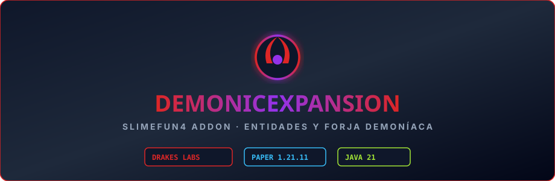

# DemonicExpansion

Criaturas y equipo demoníaco para el Nether, adaptado al ecosistema Slimefun de **DrakesCraft**
(Paper/Purpur 1.21.11, Java 21).

## Qué añade

**Criaturas** que sustituyen a las vanilla al aparecer en el Nether: el Segador, el Vulcano, el
Sabueso Infernal y el Nigromante, cada uno con sus atributos, su equipo y su comportamiento al
golpear y al ser golpeado.

**Equipo demoníaco**: la armadura completa (casco, peto, grebas y botas), cada pieza con un efecto
mientras se lleva puesta — visión nocturna, resistencia al fuego, regeneración y un caminante de
lava que convierte en obsidiana la lava de alrededor.

**Objetos**: el Anillo Demoníaco, que ciega, debilita y prende fuego a los enemigos cercanos con
un enfriamiento de 60 segundos; la Moneda de Pentecostés, que fija un punto y te lleva al Nether
y de vuelta; el Corazón de Demonio, el Napalm y un generador que solo produce sobre lava.

## Qué cambiamos

Este repositorio **no es un fork**: es el código original integrado en el ecosistema de
DrakesCraft. Los cambios son estos.

**La librería del autor ya no existía.** El addon dependía de `SmartPlugin`, de TheSilentPro,
resuelta por jitpack. Ese repositorio devuelve 404 y jitpack devuelve 401: no hay jar, no hay
fuente y no queda copia en ninguna caché, así que el addon simplemente no compilaba. Está
reimplementada en `cl.jackstar.smartplugin`, **dentro de este mismo jar**, cubriendo solo la
superficie que el addon usaba: 8 utilidades y 7 tipos base. No hace falta ningún jar aparte.

**Fuera el autoactualizador.** El original se descargaba el jar más reciente de un repositorio
ajeno y se reemplazaba a sí mismo al arrancar. En un servidor en producción eso no es una
comodidad: es que cualquier cambio de allá llega aquí sin que nadie lo revise, y además pisaría
los arreglos que hemos hecho nosotros.

**Al día con 1.21.11.** Los paquetes de Slimefun pasan a `com.github.drakescraft_labs`, que es
como está repaquetado nuestro core. Los atributos perdieron el prefijo `GENERIC_` en 1.21.3 y
`Enchantment.DAMAGE_ALL` pasó a llamarse `SHARPNESS`. Se compila contra `paper-api` 1.21.11, la
misma versión que corre en producción, para que ninguna de esas referencias reviente al arrancar.

**Todo en español.** El fork del que partimos tenía el catálogo en chino; nombres, descripciones
y mensajes están traducidos.

El paquete propio del addon y sus nombres de clase se dejan intactos, para poder seguir comparando
con el original.

## Instalación

Necesita Slimefun de DrakesCraft (`Slimefun4-Drake`). Se pone el jar en `plugins/` y listo.

## Crédito

El trabajo de fondo es de **TheSilentPro (Silent)**. Nosotros solo lo hemos adaptado. Los detalles
de procedencia y licencia están en [UPSTREAM.md](UPSTREAM.md).
